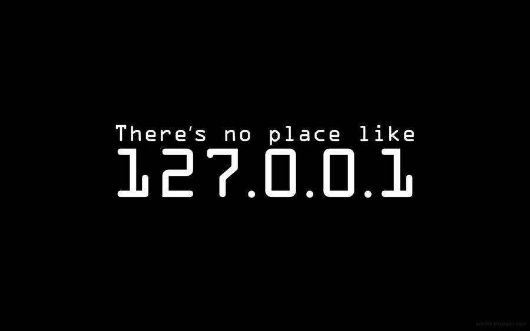

<h1 align="center">  </h1>
<h1 align="center"> Hi   , I'm Avinash</h1>
<h3 align="center">A guy who interested in Web-development and web-designing from India, and hunger to know more about the New Technology.</h3>

  

  

### About Me 🚀

- 🔭 I’m currently working on **React project.**

- 🌱 I’m currently learning **React ,Tailwind CSS.**

- 👯 I’m looking to collaborate on **React project.**

- 🤝 I’m looking for help with **Some core concepts of React.**

- 💬 Ask me about **HTML, CSS, JAVASCRIPT, BOOTSTRAP, SAAS, REACT.**

- 📫 How to reach me **avinashncs80@gmail.com**

- ⚡ Fun fact **I love to hear EDM songs.**

<h3 align="left">Languages and Tools:</h3>

 
   
 
 
 
  
  
  
   
   
  
  
  
   
   
   
  
   
   
   
   
   
   
   

&nbsp;
 

